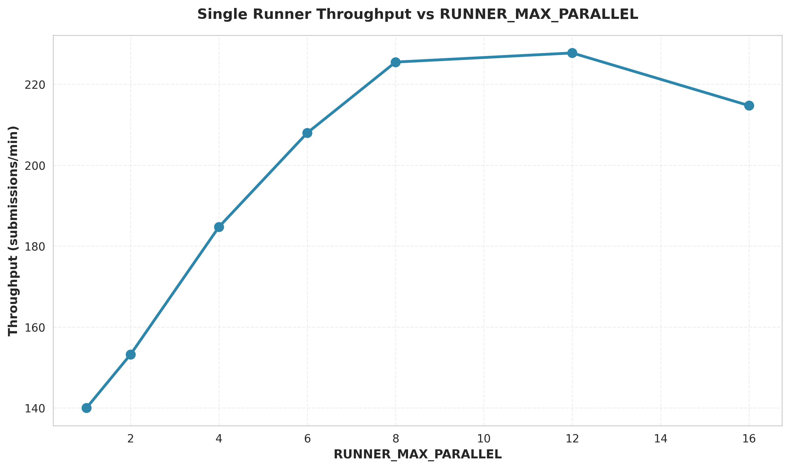
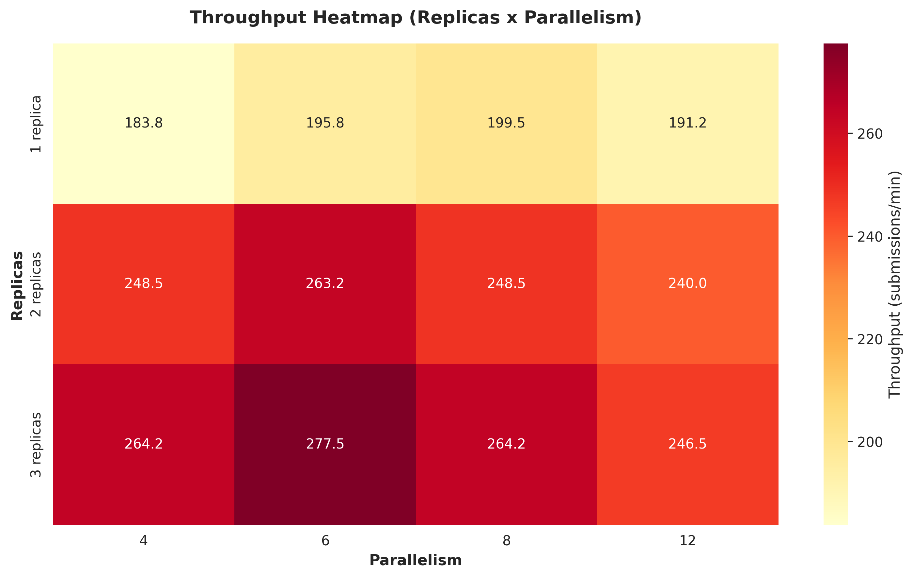
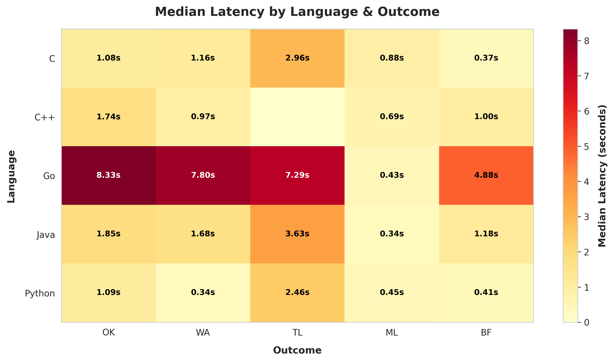
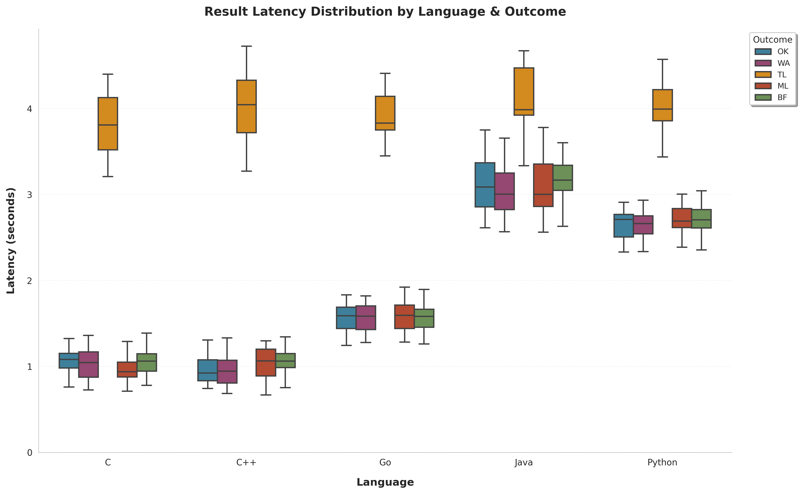
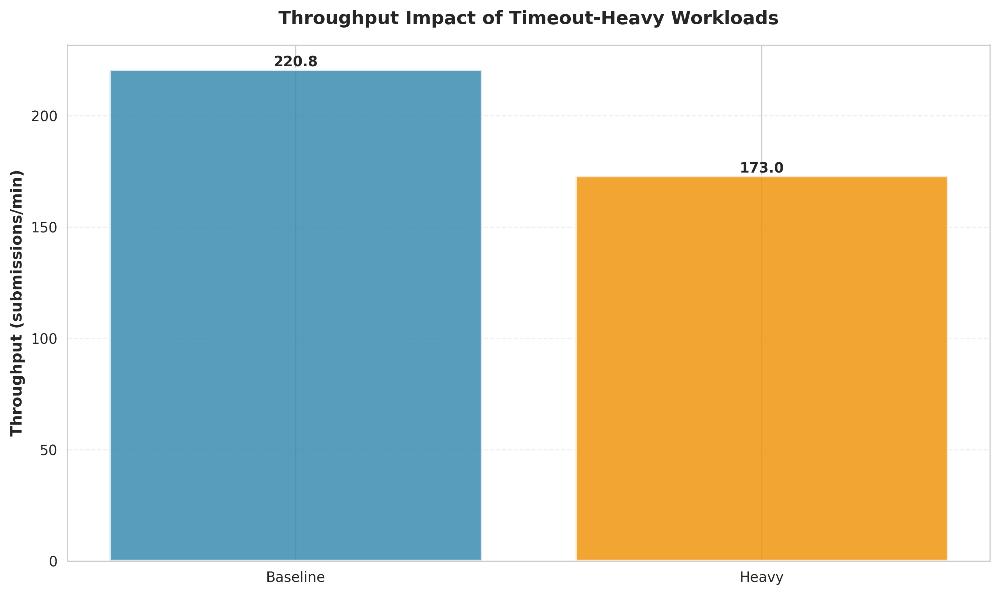

# scrc

## Overview

SCRC (System for Compiling and Running Code) is a worker service that consumes
program submissions from Kafka, enforces resource limits, executes the compiled
programs inside Docker containers, and reports the results back to Kafka. The
service is intended to power online judge / code-evaluation workloads where new
languages can be added over time, and where the execution environment must be
containerized and isolated.

### High-Level Workflow

1. **Kafka consumer** reads script submissions that contain the source code,
   requested language, optional resource limits, and test cases.
2. **Runtime registry** selects the appropriate language module and prepares the
   submission. For compiled languages (e.g. Go, C, C++, Java) this includes a build step; for
   interpreted languages (e.g. Python) it produces a ready-to-run container
   invocation.
3. **Docker runtime** executes the program inside an ephemeral container,
   respecting time and memory limits for each test case.
4. **Result publisher** serializes the outcome (status, stdout/stderr, test case
   details, error messages) and emits it back to Kafka.

### Codebase Structure

```plaintext
cmd/
  scrc/             # Application entry point and configuration wiring
internal/
  app/
    executor/       # Orchestration service pulling scripts and running suites
  domain/
    execution/      # Core domain types (scripts, limits, results, statuses)
  infra/
    kafka/          # Kafka adapters for script consumption and result publishing
  runtime/
    docker/         # Docker-based language modules and container orchestration
    interfaces.go   # Runtime engine interfaces and registry
  ports/            # Hexagonal interfaces exposed to other layers
integration/        # End-to-end tests (requires Docker & Kafka via Testcontainers)
```

- **`internal/runtime`** hosts the runtime engine abstraction plus the Docker
  implementation. Language modules live under `docker/lang_*` and are
  responsible for preparing and running programs in their language.
- **`internal/app/executor`** coordinates pulling submissions, managing
  concurrency, and producing aggregated run reports using the runtime engine.
- **`internal/infra/kafka`** defines the Kafka consumer/publisher and shared
  message envelopes used to communicate with external systems.
- **`cmd/scrc`** wires configuration from environment variables, constructs
  the runtime registry, and starts the executor loop.

## Running Locally

Run the Go program directly:

```bash
go run ./cmd/scrc
```

## Running with Docker

Build the image and run the container, mounting the host Docker socket so the service can access the Docker daemon:

```bash
docker build -t scrc .
docker run --rm -v /var/run/docker.sock:/var/run/docker.sock scrc
```

To override the Go toolchain used during the image build, specify the `GO_VERSION` build argument (defaults to `1.25.3`):

```bash
docker build --build-arg GO_VERSION=1.26.0 -t scrc .
```

## Running with Docker Compose

Use Docker Compose profiles to switch between the single-runner simulator demo
and a horizontal-scaling demonstration.

### Single Runner (Simulator Demo)

```bash
docker compose --profile single-runner --profile load-generator up --build
```

This spins up a single-node Kafka cluster, the simulator that continuously
publishes sample scripts, and a single runner container that executes each
script inside Docker. The runner keeps processing scripts until it is stopped
or its container is terminated. You can optionally limit how many scripts to
execute by setting the `SCRIPT_EXPECTED` environment variable on the runner.

### Horizontal Scaling Demo

```bash
docker compose --profile multi-runner --profile load-generator up --build --scale scrc=3
```

This profile launches Kafka/ZooKeeper plus as many runner replicas as you request
with `--scale`. Each runner shares the same consumer group so Kafka partitions
are distributed across instances, guaranteeing that every submission is handled
once. Increase the partition count of the `scripts` topic if you need to
demonstrate higher parallelism. The optional `load-generator` profile includes
the simulator so you can feed the runners; omit it and point your own producer at
Kafka to drive workloads manually.

To run the multi-runner setup without the simulator:

```bash
docker compose --profile multi-runner up --build --scale scrc=3
```

The bundled simulator service (`scrc-simulator`) publishes and consumes scripts
in a single process. Adjust its cadence or workload via the environment
variables documented below; by default it emits one full batch of scenarios per
run (`SCRIPT_ITERATIONS=1`).

### Simulator

A Python harness in `simulator/main.py` coordinates both the sample
producer and the result consumer so you can verify that every emitted script
eventually appears on the results topic. The runner:

- Loads language/outcome scripts from `simulator/scripts/<language>/<outcome>`.
- Publishes each combination (`python-ok`, `python-wa`, …, `java-bf`) for the
  configured number of iterations.
- Tails the results topic, persisting detailed logs to `simulator/consumer.log`.
- Compares produced vs consumed counters and reports mismatches before exiting.

Run it with:

```bash
python -m simulator.main
```

Tweak behavior via the existing environment variables:

- `SCRIPT_ITERATIONS` caps producer iterations (defaults to `1` for the combined run).
- `SCRIPT_INTERVAL_SECONDS` adjusts the delay between iteration batches.
- `RESULT_WAIT_TIMEOUT_SECONDS` controls how long to wait for matching results
  (defaults to `60` seconds).
- `RESULT_CONSUMER_LOG_PATH` relocates the log file if needed.

The process exits non-zero if any discrepancy is detected between produced and
consumed scripts, or if the consumer fails to observe all expected results
before timing out.

### Benchmark Suite

The benchmark harness orchestrates randomized simulator loads, sweeps runner
concurrency/replica configurations, and renders presentation-ready charts in
`logs/benchmarks`.

1. Build the runner image (needed so the harness can launch on-demand runners):

   ```bash
   docker compose build scrc
   ```

2. Launch the benchmark profile (this will start Kafka/ZooKeeper plus the harness
   container; it will terminate automatically once all matrices finish):

   ```bash
   docker compose --profile benchmark up --build scrc-benchmark
   ```

3. Inspect the outputs in `logs/benchmarks/`:

   - `single_runner_throughput.png` — throughput vs `RUNNER_MAX_PARALLEL`
   - `scaling_heatmap.png` — throughput heatmap across runner replicas × parallelism
   - `language_latency_heatmap.png` — median latency summary by language & outcome
   - `language_latency_boxplot.png` — detailed latency distributions per language/outcome
   - `timeout_impact.png` — effect of timeout-heavy submissions on throughput
   - `language_throughput.png` — share of throughput per language/outcome
   - `benchmark_manifest.json` — manifest summarizing generated artifacts
   - CSV snapshots for each benchmark case

Use the environment variables documented in `simulator/benchmarks/main.py` to
customize broker endpoints, output paths, or override the benchmark plan.

#### Benchmark Results

The benchmark suite generates several charts that provide insights into system
performance, scalability, and language-specific characteristics:

**Single Runner Throughput** (`single_runner_throughput.png`)


Shows how throughput (submissions per minute) scales with `RUNNER_MAX_PARALLEL`
for a single runner instance under medium load. This helps identify the optimal
parallelism setting for a single runner. Typically, throughput increases with
parallelism up to a point where resource contention or overhead begins to
dominate.

**Scaling Heatmap** (`scaling_heatmap.png`)


A heatmap visualizing throughput across different combinations of runner replicas
and parallelism values. Darker colors indicate higher throughput. This chart
helps answer questions like:

- What combination of replicas and parallelism yields the best throughput?
- Does horizontal scaling (more replicas) or vertical scaling (more parallelism)
  provide better performance?
- Where are the performance sweet spots in the configuration space?

**Language Latency Heatmap** (`language_latency_heatmap.png`)


A summary view showing median latency (in seconds) for each language-outcome
combination. The color intensity indicates latency magnitude, with darker reds
representing higher latencies. Key insights:

- Which languages are fastest/slowest for different outcome types
- Memory limit (ML) outcomes typically have very low latency across all
  languages (quick detection)
- Time limit (TL) outcomes show varying latencies depending on language
- Go often shows higher latencies for OK/WA outcomes due to compilation overhead

**Language Latency Distribution** (`language_latency_boxplot.png`)


Detailed box plots showing the full distribution of latencies for each
language-outcome pair. The boxes show quartiles (25th, 50th, 75th percentiles)
with whiskers extending to show the range. This reveals:

- Variability in execution times (wider boxes = more variance)
- Outliers and extreme cases
- Differences in latency distributions between languages for the same outcome
- Whether certain languages have more consistent or more variable performance

**Timeout Impact** (`timeout_impact.png`)


Compares throughput between a baseline workload and a timeout-heavy workload
(where TL submissions are weighted 2.5x higher). This answers:

- Do timeout-heavy submissions significantly impact overall system throughput?
- How well does the system handle workloads with many long-running submissions?
- Whether timeout detection and cleanup is efficient

**Language Throughput Share** (`language_throughput.png`)


A stacked bar chart showing the percentage distribution of submissions across
languages and outcomes under heavy load. Each bar represents 100% of
submissions, with colored segments showing the proportion of each outcome type
per language. This reveals:

- Which languages dominate the workload
- The distribution of outcomes (OK, WA, TL, ML, BF) per language
- Whether certain languages tend to produce more of certain outcome types

### Language Runtimes

Each language runtime can be customized by overriding the container image or working
directory via environment variables:

- `PYTHON_IMAGE` / `PYTHON_WORKDIR` (default image `python:3.12-alpine`)
- `GO_IMAGE` / `GO_WORKDIR` (default image `golang:1.22-alpine`)
- `C_IMAGE` / `C_WORKDIR` (default image `gcc:14`)
- `CPP_IMAGE` / `CPP_WORKDIR` (default image `gcc:14`)
- `JAVA_IMAGE` / `JAVA_WORKDIR` (default image `eclipse-temurin:21-jdk-alpine`)

## Script Payload

Messages published to the scripts topic must include:

- `id`: unique identifier for the submission
- `language`: execution language (e.g. `python`, `go`, `c`, `cpp`, `java`)
- `source`: program source code
- `limits` (optional): time and memory limits
- `tests` (optional): input/output expectations

The runner performs a build step first (no-op for Python, compile for Go, C, C++, and Java) and
then measures the program's execution separately. Build failures are reported
with the `BF` status code. The sample producer currently emits Python, Go, C, C++, and Java
programs.

## Testing

Run the fast (unit) suite:

```bash
go test ./...
```

Integration tests exercise the Kafka infrastructure and Docker-backed runner.
They require access to a Docker daemon and will spin up ephemeral containers via
Testcontainers:

```bash
go test -tags=integration ./...
```
